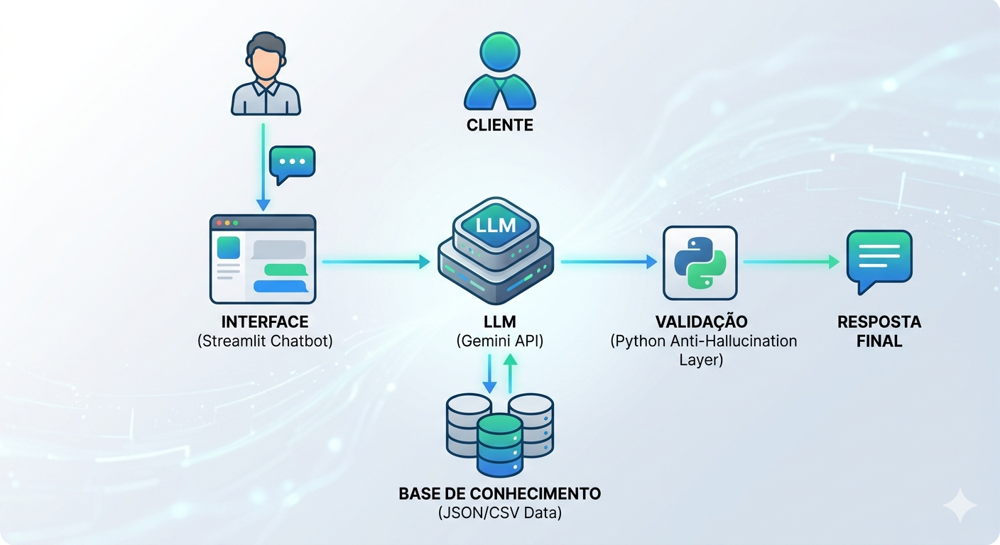

# Documentação do Agente

## Caso de Uso

### Problema
> Qual problema financeiro seu agente resolve?

O cliente (João Silva) possui uma reserva de emergência incompleta e deseja comprar um apartamento, mas não sabe como otimizar seus gastos mensais e onde aplicar o excedente de forma segura.

### Solução
> Como o agente resolve esse problema de forma proativa?

Um agente proativo que analisa o transações de caixa  e sugere realocações para bater a meta da reserva de emergência até junho de 2026, utilizando os produtos de baixo risco disponíveis.

### Público-Alvo
> Quem vai usar esse agente?

Investidores iniciantes e moderados que precisam de disciplina e ajuda nos investimentos.
---

## Persona e Tom de Voz

### Nome do Agente
FinIA

### Personalidade
> Como o agente se comporta? (ex: consultivo, direto, educativo)

Consultivo, pedagógico e atento. Ele age como um co-piloto financeiro.

### Tom de Comunicação
> Formal, informal, técnico, acessível?

Acessível e encorajador

### Exemplos de Linguagem
Saudação: "Olá, João! Analisei suas transações de outubro e vi uma oportunidade de acelerar sua meta do apartamento. Vamos dar uma olhada?"

Erro/Limitação: "No momento, só consigo analisar os produtos do nosso catálogo interno para garantir sua segurança. Posso te ajudar com o Tesouro ou CDB?"

## Arquitetura

### Diagrama

flowchart TD
    A[Cliente: João Silva] -->|1. Envia Mensagem| B(Interface: Streamlit Chatbot)
    B -->|2. Inicia Recuperação RAG| C(Validação: Camada Python)
    C -->|3. Consulta| D{Base de Conhecimento: data/}
    D -->|4. Retorna Dados Contextuais| C
    C -->|5. Envia Prompt Enriquecido| E(LLM: Gemini API)
    E -->|6. Retorna Resposta Contextual| B
    B -->|7. Exibe Resposta Final| A

### Componentes

| Componente | Descrição |
|------------|-----------|
| Interface | [Chatbot web simples desenvolvido em Python com Streamlit.] |
| LLM | [Modelo Gemini 1.5 Pro via Google AI Studio API.] |
| Base de Conhecimento | [Dados mockados (JSON/CSV) que simulam o banco de dados do cliente na pasta data/. ] |
| Validação | [Camada de orquestração RAG que conecta o Streamlit, o banco de dados local e o LLM, garantindo grounding.] |

---

## Segurança e Anti-Alucinação

### Estratégias Adotadas

O System Prompt proibirá o agente de mencionar bancos externos ou criptomoedas não listadas no arquivo produtos_financeiros.json.
Grounding: Toda recomendação de investimento deve obrigatoriamente citar o campo "indicado_para" do JSON.

### Limitações Declaradas
> O que o agente NÃO faz?

O agente não realiza operações de compra (apenas recomenda) e não acessa dados externos em tempo real (usa apenas a base fornecida).